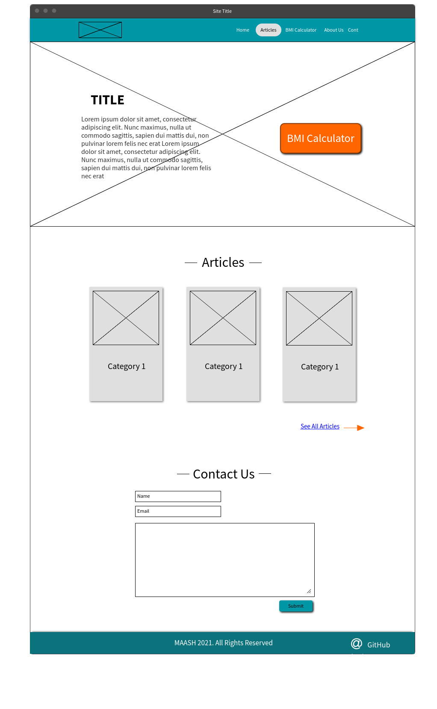

# 201 Final Project

## Food Awareness

This website is about health and food awareness, it’ll contain three main sections, one for children health, one for adults, and the last one will have the user input his/her personal details and get a personalized diet and information.

### Author: Afnan Damra - Ayoub Kandah - Hamza Shamoun - Mo'tasem Odeh - Shatha Abu Ali

### Deployed Website
[MAASH](https://foodawareness.github.io/foodawareness/)

## Wireframe

## User Stories
1. As a user, I want to calculate my BMI so that I know my healthy weight.
2. As a website visitor, I want to read articles about health so that I can improve my lifestyle.
3. As a website developer, I want the user to get the most of my website so that they visit it again.
4. As a user, I want to find out my BMR so that I can plan my daily meals.
5. As a website developer, I want to get in touch with the users and recieve their feedback so that I can keep improving the website.

### Links and Resources

* contact Form
[Refrence 1](https://www.w3schools.com/howto/howto_css_contact_form.asp)

* background Image
[Refrence 2](https://www.pexels.com/photo/man-running-on-dirt-road-1465892/)

* before after css
[Refrence 3](https://stackoverflow.com/questions/28434521/use-before-after-pseudo-element-to-make-a-line/28434792)

* modal submit contact us
[Refrence 4](https://www.w3schools.com/howto/tryit.asp?filename=tryhow_css_modal)

